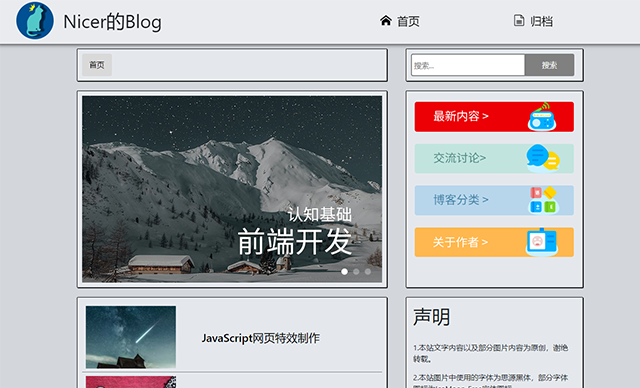

# joomla-template-coldgrey
> A very simple template for joomla.
> 
> Please change all the pictures when using,because they are not free.

## Customize

1. The pictures and links of the slider.
2. The contents and links in archive menu.
3. Four Pictures' links in the right.
4. The content in "Owner's Words".

**You can change things above in "Template>style>coldgrey-Default".**

## Module Postions

postion-nav\Crumbs Navigation

postion-search\SearchBox

position-right\Owner's Word

component\Main Output

## Main Output

### Home
The template only provide 'postion-right' in homepage.

### Passages 
Code and quote have different background color.

Code has been highlighted.

Used CSS code in plug-in MarkdownPreviewEnhanced in Vscode.(text.css)

## 404Page
Tencent 404 page.
